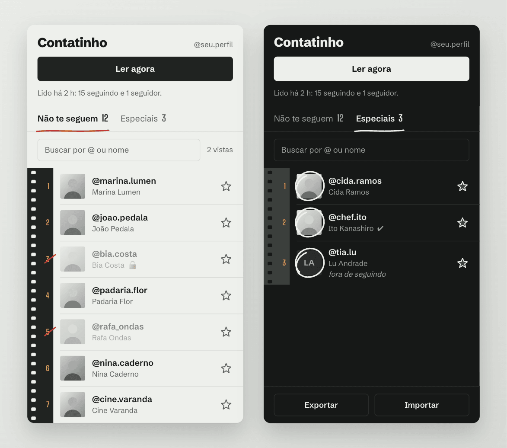

  <picture>
    <source media="(prefers-color-scheme: dark)" srcset="docs/brand/lockup-dark.svg">
    
  </picture>

A contact sheet of the people you follow who don't follow you back.

<a href="README.pt-BR.md">Leia em português</a>

  

In Brazilian Portuguese, a contatinho is someone you keep in your contacts, just in case. Contatinho is a Chrome extension that opens a side panel next to Instagram and shows which of those people never followed you back. No drama. Some of them are museums.

I built it for my own following cleanup and figured other people might like it too.

## What it does

Click "Ler agora" (read now) and the panel goes through your following and followers lists, then lays out the people who don't follow back on a strip of film, in the order you followed them. Click a name and the profile opens in the Instagram tab, so you can decide right there. The frame number gets a pencil mark, which helps a lot when the list is long.

Some accounts you follow on purpose: big profiles, the bakery down the street, that one friend who never follows anyone. Star them and they move to "Especiais", out of the way. You can export that list to a file and import it back later. Verified accounts get their own strip at the end.

## What it doesn't do

It never follows, unfollows, likes or comments. That part stays with you, inside Instagram's own interface.

Every request is a GET to a short, fixed list of the same endpoints instagram.com uses when you open your followers list. Only one file in the code talks to the network, `src/lib/ig.ts`, and a test fails if any other file tries. Pages are read with a one to two second pause, and there's a five minute lock between readings (fifteen if Instagram asks for a break).

Nothing leaves your browser. There's no server and no analytics: readings, specials and profile thumbnails live in the extension's local storage.

## Install

Contatinho isn't on the Chrome Web Store (yet?). To load it yourself you need Chrome 116 or newer, plus Docker or Node 20+.

1. Clone this repository.
2. Build it with `make build` (Docker) or `npm ci && npm run build` (Node).
3. Open `chrome://extensions`, turn on Developer mode, click "Load unpacked" and pick the `dist` folder.
4. Open instagram.com, click the Contatinho icon, then "Ler agora".

To update, pull, build again and hit the reload button on the extension card. Don't remove it and add it back: removing the extension deletes your specials. Export them first if you ever need to.

The interface is in Portuguese for now.

## Good to know

Instagram has no official API for this, so Contatinho relies on the site's internal web endpoints, and those can change without notice. If readings start failing with a format error, please open an issue.

Big accounts take a while. Instagram hands out followers roughly 25 at a time, so an account with around 1,300 followers needs two or three minutes.

## Development

`make test` runs the test suite (Vitest), `make lint` runs svelte-check, `make build` builds into `dist/` and `make icons` regenerates the PNG icons from the SVGs. Everything runs in a Docker container. Notes on how the pieces fit together are in [AGENTS.md](AGENTS.md), in Portuguese.

Issues and pull requests are welcome. Please keep it read-only.

## Not affiliated with Instagram

Contatinho is not affiliated with, endorsed by or connected to Instagram or Meta. Instagram is a trademark of Meta Platforms, Inc. Automated access to Instagram may go against its terms of use, so use Contatinho on your own account, at your own pace and at your own risk.

## License

Apache-2.0. See [LICENSE](LICENSE).
